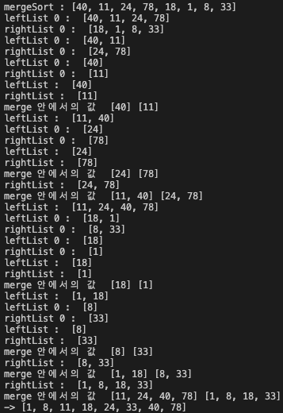
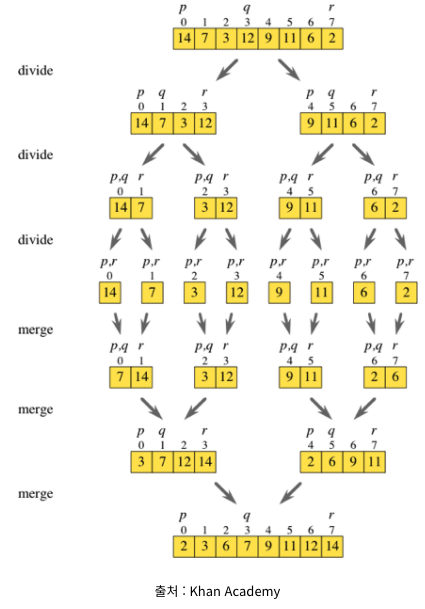

# quickSort(퀵 정렬)
## 목차
- [퀵 정렬 개념](#개념)
- [퀵 정렬 동작 방식](#동작-방식)
- [퀵 정렬 특징](#특징)
- [퀵 정렬 시간복잡도와 공간복잡도](#시간복잡도)
- [퀵 정렬 python code](#python-code)
- [퀵 정렬 c++ code](#c-code)
- [참조](#참조)

#### <a id="information"></a>
### 개념 
기준 값(pivot)을 중심으로 작은 원소들은 왼쪽 부분집합으로, 큰 원소들을 오른쪽 부분집합으로 분할하여 정렬하는 방식의 정렬 알고리즘이다. <br>
퀵 정렬도 **분할 정복(divide and conquer)기법** 중 하나인데, 병합 정렬과의 차이가 존재한다. <br>
**병합 정렬**은 **분할 후 정복**하는 원리였다면, **퀵 정렬**은 **정복 후 분할**하는 원리의 알고리즘이다. <br>
기준 값(pivot)보다 작은 원소들을 왼쪽 부분집합으로, 큰 원소들을 오른쪽 부분집합으로 구분하는 **정복**을 수행하고, <br>
기준 값(pivot) 중심으로 2개의 부분 집합으로 **분할**한다.

#### <a id="How it works"></a>
### 동작 방식
0. 정렬한 상태의 자료를 담기 위해 입력 자료의 크기만큼의 새로운 배열(리스트)를 선언
1. 입력 자료를 두 개의 부분집합으로 분할하고, 각 부분집합을 계속해서 2개로 분할하여 모든 부분집합의 원소가 1개일 때까지 분할
2. 원소가 1개인 2개의 부분집합 원소의 크기를 비교하여 오름차순으로 정렬 상태를 담기위한 배열(리스트)로 병합
3. 원소가 2개 이상인 부분집합들을 병합할 때는 다음과 같은 흐름에 따라서 정렬을 진행
- 병합 대상인 두 부분집합 leftList와 rightList의 0 번째 원소 크기 비교
- 더 작은 원소를 새로운 리스트에 삽입 (leftList[0] > rightList[0]라고 가정)
- rightList에서는 이미 0번째 원소가 삽입이 되었기 때문에 leftList[0]과 rightList[1]의 크기 비교
- 위와 같의 과정을 반복하여 둘 중에 한쪽 List가 다 삽입이 되는 경우에는 위의 과정을 중단 (rightList가 먼저 다 삽입 되었다고 가정)
- 아직 삽입이 끝나지 않은 leftList의 남은 원소들을 새로운 리스트에 순차적으로 삽입
4. 부분집합의 원소 개수가 2개, 4개, ...,n개(처음 원소의 개수)가 될 때까지 반복

 <br>
위의 사진은 8개의 원소가 들어가있는 배열의 동작되는 과정을 프린트 해본 것이다.

#### <a id="characteristic"></a>
## 특징
- 연결 리스트(Linked List)로 구현 시 **In-place(제자리 정렬)** 알고리즘이다. <br>
(링크 인덱스만 변경되므로 데이터의 이동은 무시할 수 있을 정도로 작아짐)<br>
- 배열(Array)로 구현 시 **Not-In-place(비제자리 정렬)** 알고리즘이다. (임시 배열이 필요) <br>
- **stable(안정적)** 알고리즘이다.<br>
- 가장 빠르다고 알려진 퀵 정렬(quickSort)과 평균 시간 복잡도가 동일 <br>
(세심하게 따져보면 평균적인 상황에서는 quickSort가 더 빠른편이고, mergeSort는 n만큼의 추가공간이 필요하다는 단점도 존재) <br>
그러나 파이썬에 내장되어 있는 정렬(sort, sorted)메소드의 경우에는 최악의 경우 시간복잡도가 O(N^2)인 quickSort가 아닌 합병 정렬과 삽입 정렬을 혼합한 Tim Sort(팀 정렬)사용

#### <a id="time complexity"></a>
## 시간복잡도

### 연산시간
1. **분할 단계** : n 개의 원소를 분할하기 위해서 **log2 n번**의 단계를 수행 <br>
e.g. 위의 사진을 보면, 8개의 원소를 가진 리스트를 3회(log2 (8))에 걸쳐 1개의 원소를 가진 부분집합으로 분할<br>

2. **병합 단계** : 부분집합의 원소를 비교하면서 병합하는 단계에서 최대 **n번**의 비교연산 수행<br>
e.g. 위의 사진에서 총 15번 비교연산 수행 (병합 1단계 : 4회, 병합 2단계 : 5회, 병합 3단계 : 6단계)

### 시간 복잡도
시간 복잡도의 최선, 평균, 최악 모두 **O(Nlog N)** 으로 동일하다.<br>

## 공간복잡도
원소 **n개**에 대해서 **2n개**의 메모리 공간을 사용 **(각 단계에서 병합하여 만든 부분집합을 저장할 공간이 필요)** 

#### <a id="python code"></a>
## python code
```python
#quickSort 코드
import time
start = time.time()

def quickSort(lst):
    if len(lst) <= 1:
        return lst
    
    pivot = lst[len(lst)//2]
    less_arr, equal_arr, greater_arr = [],[],[]
    
    for num in lst:
        if num < pivot:
            less_arr.append(num)
        elif num > pivot:
            greater_arr.append(num)
        else:
            equal_arr.append(num)

    return quickSort(less_arr)+equal_arr+quickSort(greater_arr)

from random import randint
lst = [randint(1,101) for i in range(8)] # 1부터 101사이의 랜덤 값을 8개의 list 안에 초기화
print("quickSort :", lst, end=" "); print ("->",quickSort(lst))
print("time : ", time.time()-start )
``` 
위의 코드의 경우 구현이 간단하지만 재귀함수를 호출할 때 마다 매번 새로운 리스트를 생성하여 리턴하기 때문에 <br>
**메모리 사용 측면에서 효율적이지 못하다**고 할 수 있다.<br>
따라서 in-place 정렬로 코드를 수정하기 위해서 다음과 같은 코드를 작성했다. <br>
위의 코드와 동일하게 값의 대소 비교를 위해서 pivot값을 사용 하지만, 분할은 기준점이 pivot이 아닌 경우도 발생하게 된다. <br>
실제로 pivot 값을 기준으로 대소 비교 시 좌측과 우측의 원소의 개소가 일치하여 공간이 딱 맞는 경우가 드물기 때문이다. <br>

```python
#quickSort in-place 코드
import time
start = time.time()

def quickSort(lst):
    def sort(low, high): 
        if high <= low: #high와 low의 순서가 바뀌면 탈출 
            return

        mid = partition(low, high) 
        sort(low, mid-1)
        sort(mid, high)

    def partition(low, high): #분할 기준점의 인덱스(low)를 반환
        pivot = lst[(low + high) // 2]
        while low <= high:
            while lst[low] < pivot:
                low += 1
            while lst[high] > pivot:
                high -= 1
            if low <= high:
                lst[low], lst[high] = lst[high], lst[low]
                low, high = low + 1, high -1
        return low

    return sort(0,len(lst)-1)

from random import randint
lst = [randint(1,101) for i in range(8)] # 1부터 101사이의 랜덤 값을 8개의 list 안에 초기화
print("quickSort :", lst, end=" "); quickSort(lst); print ("->",lst)
print("time : ", time.time()-start )
``` 

#### <a id="c++ code"></a>
## c++ code
```c++
#include<iostream>
#include<string>
int cnt =0;

void merge(int arr[], int left, int mid, int right){
    int i = left, j = mid + 1, k = left ;
    int sorted_arr[1000];
    while(i <= mid && j <= right){
        if(arr[i] <= arr[j]){
            sorted_arr[k++] = arr[i++];
        }else{
            sorted_arr[k++] = arr[j++];
        }
    }
    if(i>mid){
        for(int m = j; m <= right; m++){
            sorted_arr[k++] = arr[m];
        }
    }else{
         for(int m = i; m<= mid; m++){
            sorted_arr[k++] = arr[m];
        }
    }
      for (int m = left; m <= right; m++) {
        arr[m] = sorted_arr[m];
    }
}
void mergeSort(int arr[], int left, int right){
    int mid =0;
    
    if(left < right){
        cnt++;
        mid = (left + right)/2;
        mergeSort(arr, left, mid);
        mergeSort(arr, mid +1, right);
        merge(arr, left, mid, right);
    }
}

int main(){
    int len = 0;
    std::cin >> len;
    int *arr = new int[len];
    for(int i = 0; i< len ; i++){
        std::cin >> arr[i];
    }
    mergeSort(arr, 0, len - 1);
    for(int i = 0; i < len; i++){
        printf("%d ", arr[i]);
    }
    return 0;
}
```
#### <a id="references"></a>
### 참조
아래의 링크를 참조하여 작성하였습니다. <br>
[몽구의 우탕탕탕 개발 공부](https://mong9data.tistory.com/48?category=885884)<br>
[Dale Seo](https://www.daleseo.com/sort-quick/)
