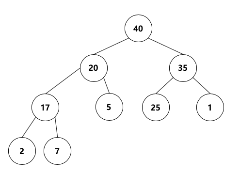
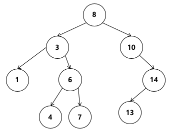
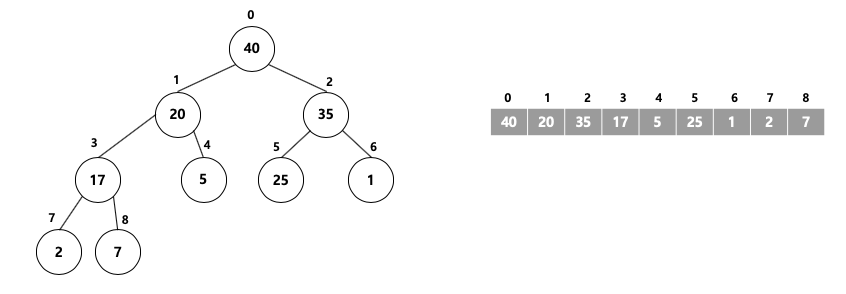
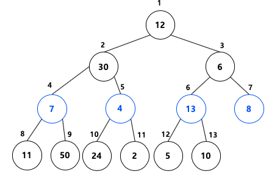
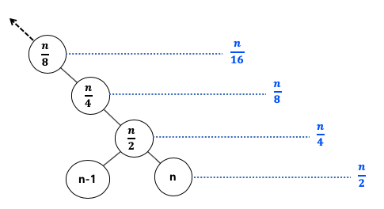

# 힙 정렬(HeapSort)

## 목차

- [힙 개념](#개념)

- [힙 VS 이진탐색나무](#Heap-vs-Binary-Search-Tree)

- [힙을 배열로 표현](#Heap을-Array로-표현)

- [Heapify](#Heapify)

- [Heap insert & delete](#Insert-&-Delete)

- [Build Heap](#Build-heap)

- [힙 정렬 동작 방식](#동작-방식)

- [힙 정렬 특징](#특징)

- [힙 정렬 시간복잡도](#시간복잡도)

- [힙 정렬 python code](#python-code)

- [힙 정렬 c++ code](#c-code)

- [참조](#참조)


## 개념

**힙(Heap)** 은 큰 키(우선 순위)에 자주 액세스 하거나 키(우선 순위) 중심으로 정렬된 시퀀스를 활용해야할 때 유용한 **자료구조** 이다. <br>

힙은 한 노드(node)가 최대 두 개의 자식노드(child node)를 가지면서, 마지막 레벨을 제외한 모든 레벨에서 노드들이 꽉 채워진 <br>

**완전이진트리(complete binary tree)** 를 기본으로 한다. <br>


힙 속성(heap property)는 다음의 두 가지이다.<br>

1. **Head order property** : 각 노드의 값은 자신의 자식노드가 가진 값보다 크거나 같다 (Max heap), <br>

   ​										  각 노드의 값은 자신의 자식노드가 가진 값보다 작거나 같다 (Min heap)<br>

2. **Heap shape property** : 모양은 완전 이진트리이다. 즉 마지막 레벨의 모든 노드는 왼쪽에 쏠려 있다. <br>


아래의 사진은 최대 힙 속성을 만족하는 자료구조이다.




## Heap vs Binary Search Tree

힙과 이진탐색트리는 모두 이진트리라는 점에서 공통점을 가진다. <br>

하지만 노드값이 다소 다르게 구성되어 있는 점을 아래의 이진탐색트리사진을 보면 알 수 있다. <br>

힙은 각 노드의 값이 자식 노드보다 큰 반면,이진탐색트리는 왼쪽 자식노드가 제일 작고 부모노드가 그 다음 크며 오른쪽 자식노드가 가장 큰 값을 가진다. <br>

**힙은 우선순위(키) 정렬**에, **이진탐색트리는 탐색에 강점**을 지니는 자료구조이다. <br>




## Heap을 Array로 표현



힙은 완전이진트리의 성질을 만족하므로 위의 그림과 같이 1차원 배열로 표현이 가능하다.<br>

파이썬이나, C++에서는 데이터의 index가 0 부터 시작하므로 자식 노드의 인덱스는 다음과 같이 표현할 수 있다. <br>

index는 어떤 노드의 인덱스를 의미한다. <br>

```python
left_index = 2 * index + 1
right_index = 2 * index + 2
```


## Heapify

주어진 자료구조에서 **힙 성질을 만족하도록 하는 연산**을 **heapify**라고 한다. 아래의 그림이 그 예시이다.


먼저 root 노드인 4를 보았을 때, 4는 왼쪽 자식노드 20 보다 작으므로 힙의 성질을 만족하지 못한다. <br>

(오른쪽의 35보다도 작지만 알고리즘 구현 상 왼쪽 자식 노드 우선) <br>

따라서 4와 20의 위치를 바꿔준다. 위치를 변경 후에 힙의 성질이 유지되는지 살펴보아야 한다. <br>

4는 새로운 왼쪽 자식 노드 2보다는 크지만 오른쪽 자식노드 5보다는 작으므로 힙의 성질을 만족하지 못한다. 따라서 4와 5의 위치를 바꿔준다. <br>

위치 변경 이후에 힙의 성질이 유지되는지 살펴야하지만 더 이상 살펴볼 자식 노드가 없으므로 연산 수행을 종료한다. <br>

이러한 Heapify를 코드로 작성하면 다음과 같다.

```python
def heapify(arr, index, size):
  	largest = index
    left_index = 2 * index + 1
    right_index = 2 * index + 2
    
    if left_index < size and arr[left_index] > arr[largest]:
      	largest = left_index
    if right_index < size and arr[right_index] > arr[largest]:
      	largest = right_index
    if largest != index :
      	arr[largest], arr[index] = arr[index], arr[largest]
      	heapify(arr, largest, size)
```

heapify의 계산 복잡도는 최악의 경우 루트노드에서 잎새노드까지 값을 비교해야하므로 트리의 높이(h=log2 n)에 의존적이다. <br>

값을 바꾸거나 비교하는 연산은 O(1)이므로 계산 복잡도는 **O(log n)**이다.


## Insert & Delete

힙은 자료구조의 일종이므로 삽입 연산이 가능해야한다. 힙 속성 가운데 shape 속성을 만족하려면 새로운 노드는 아래의 그림과 같이 <br>

마지막 레벨의 비어있는 공간 가운데 가장 왼쪽에 들어가게 해야한다. <br>


예를 들어 다음과 같은 힙 구조에서 18을 삽입한다고 하면 마지막 레벨의 비어있는 공간 가운데 가장 왼쪽, 즉 5의 오른쪽 자식노드 위치에 처음으로 들어가게 된다. <br>


그러나 18이 들어오면서 힙의 성질이 만족되지 못하므로 heapify를 통해서 성질을 만족시켜주어야한다. <br>

먼저 18의 부모노드인 5와 비교하고 위치를 바꾸어준다. 이때 형제 노드에 대해서는 값을 비교할 필요가 없는데, <br>

그 이유는 이미 힙 속성을 유지하고 있는 완전이진트리이기 때문에 형제노드는 자신의 부모노드보다는 작거나 같다는것이 보장 되어 있기 때문에 <br>

heapify를 진행할 때는 부모노드와만 비교를 수행해도 된다. <br>

따라서 **삽입 연산 시** heapify는 **아래에서 위** 로 heapify를 진행해 준다. <br>

삽입 연산의 **계산 복잡도** 는 삽입 연산 시 O(1), 해당 노드를 heapify하는데 O(log n)이 소요되므로 전체적으로 **O(log n)** 이 된다. <br>

---

이제는 삭제 연산에 대해서 살펴보자. <br>


18이라는 원소를 위의 힙 구조에서 삭제하려고 할 때, 마지막 레벨의 마지막 값(힙을 배열로 표현했을 때 가장 마지막 원소) 5를 삭제된 원소의 위치에 옮긴다. <br>

이후 5가 잎새 노드에 다다르기까지 **위에서 아래**로 heapify를 진행해준다. <br>

삭제 연산의 계산 복잡도는 삭제하는데 드는 연산 O(1), 배열의 마지막 노드를 삭제위치로 옮기는 연산 O(1) <br>

해당 노드를 heapify하는데 드는 연산 O(log n) 해서 **O(log n)**이다. <br>


## Build heap

임의의 숫자들을 최대 힙으로 구성하는 연산 과정을 **build heap** 이라고 한다. 예를 들어 다음과 같은 리스트가 주어졌다고 해보자. <br>

list = [12, 30, 6, 7, 4, 13, 8, 11, 50, 24, 2, 5, 10] <br>

이때 위 숫자들을 가지고 build heap을 하는 가장 단순한 방법은 **차례대로 insert 연산을 수행** 하여 힙을 만들어가면 된다. <br>

하지만 이 경우에는 삽입해야하는 노드의 수가 n개라면 노드의 하나의 insert 연산을 총 n 번 반복 수행해야한다. <br>

이 때 마지막 원소를 insert할 때 힙을 이미 구성하고 있는 노드의 수는 n - 1개일 것이므로 insert 연산의 복잡성은 O(log n) 이고 <br>

이 단순한 방법의 계산 복잡도는 **O(nlog n)**이 된다. 이때 이러한 계산 복잡도를 줄이는 방법은 다음과 같다. <br>

아래의 그림과 같이 잎새노드를 가지지 않는 노드 (배열의 개수를 2로 나눈 몫을 인덱스로 하는 노드)부터 차례대로 heapify를 수행하는 것이다. <br>



즉 8, 13, 4, 7 순서대로 **위에서 아래로 heapify를 수행**하는 것이다. 이러한 방식으로 build heap을 하게되면 계산 복잡도는 다음과 같다. <br>

1개의 노드를 heapify하는데 드는 연산 O(log n)이고, n/2개 노드에 대해 heapify를 수행해야하므로 <br>

전체적인 연산은 O(nlog n)으로 단순한 방법과 똑같다. 하지만 조금만 더 생각해보자. <br>

다음과 같은 모든 레벨의 노드가 꽉 차있는 정이진트리(full binary tree)에서 오른쪽 맨 끝에 해당한다.



노드 안의 숫자들은 노드 수가 n개인 이진트리를 배열로 표현했을 때 인덱스를 나타낸다. 인덱스가 n인 데이터는 정이진트리의 오른쪽 끝 잎새노드라고 할 수 있다.<br>

잎새노드에 해당하는 레벨을 d라고 했을 때 레벨이 d인 노드 수는 n/2개 이다. 왜냐하면 레벨 d−1의 오른쪽 끝 노드의 인덱스가 n/2이기 때문이다.<br>

레벨이 d−1인 노드의 수는 전체 노드(n)에서 레벨 d에 해당하는 노드 수(n/2)와 레벨 d−2에 해당하는 노드 수(n/4)를 뺀 n/4개가 됩니다.<br>

**build heap**의 계산 복잡도은 수행 대상의 노드가 전체 트리에서 차지하는 높이, 그리고 수행 대상 노드 수에 비례한다. <br>

레벨 d−1에 해당하는 노드는 그 높이가 1(=잎새노드까지의 엣지 수)입니다. 마찬가지로 레벨 d−2는 2, d−3은 3이 된다. 

따라서 build heap의 계산복잡도을 대략적으로 나타내면 다음과 같습니다.

0 x n/2^1 +1 x n/2^2 +2 x n/2^3 +3 x n/2^4 + … 

  = n/4 x (1+2 x  1/2+3 x  1/4 + …)

  = n/4 x c = **O(n)**

지금 설명한 방법이 단순하게 힙에 차례로 *insert* 연산을 수행해 힙을 만들어가는 방식보다 더 효율적임을 확인할 수 있다.<br>


## 동작 방식

힙 정렬의 동작방식은 다음과 같다. <br>

1. 주어진 원소들로 **최대 힙을 구성**한다. (build heap)
2. 최대 힙의 **루트노드(현재 배열의 첫번째 원소)**와 말단 **노드(현재 배열의 마지막 원소)를 교환**해준다.
3. **새 루트노드에 대해 최대 힙**을 구성한다. 이때 사이즈는 하나씩 빼준다. (2번을 한번 수행시마다 최대값을 구해지므로)
4. 원소의 개수만큼 2-3을 반복수행 한다.<br>


## 특징

\- **불안정(unstable) 정렬** 알고리즘이다. <br>

\- **제자리(in-place) 정렬** 알고리즘이다. <br>

\- 전체 자료를 정렬하는 것이 아니라 **가장 큰 값 몇개만 필요할 때** 가장 유용하다. 


## 시간복잡도

힙 정렬의 계산 복잡도는 다음과 같다. 

1. 우선 최초로 **최대 힙을 만드는 연산**의 계산 복잡도는 위에서 확인 하였듯이 **O(n)**이다. <br>
2. 여기에 힙이 구성된 상태에서 **각 노드에 대해서 heapify를 수행하는 연산**은 말단 노드(최댓값)가 루트 노드에 올라오기까지의 트리의 높이(데이터가 n개일 때 h = log2 n)만큼 <br>
자리 이동을 해야한다. 이러한 노드가 n개 있으므로 **O(nlog n)**이 된다. 

따라서 힙 정렬의 계산복잡도는 O(n) + O(nlog n)이므로 결과적으로 **O(nlog n)**이 된다.<br>


## python code

```python
# heap정렬 파이썬 코드
def heapify(arr, index, size):
    largest = index
    left_index = index * 2 + 1
    right_index = index * 2 + 2

    if left_index < size and arr[largest] < arr[left_index]:
        largest = left_index
    if right_index < size and arr[largest] < arr[right_index] :
        largest = right_index

    if largest != index:
        arr[index], arr[largest] = arr[largest], arr[index]
        heapify(arr, largest, size)

def heapSort(arr): 
    size = len(arr) 
  
    # build max heap을 하는 과정 (전체 크기의 반부터 즉 O(n)이 나오는 연산으로 수행)
    for i in range(size//2 - 1, -1, -1): 
        heapify(arr, i, size) 
  
    # max heap이 구현된 arr에서 root node(최대값)을 말단 노드(최소값)과 바꾸고 heapify 수행
    # 이떄 heapify를 할 때 heap tree의 크기를 1씩 빼서 보내주는 것이 핵심이다. 
    for i in range(size - 1, 0, -1): 
        arr[i], arr[0] = arr[0], arr[i] 
        heapify(arr, 0, i) 

from random import randint
arr = [randint(1,101) for i in range(8)] # 1부터 101사이의 랜덤 값을 8개의 list 안에 초기화
print("정렬 전 : ", arr, end=" ") 
heapSort(arr)
n = len(arr) 
print ("-> 정렬 후 : ", end="") 
for i in range(n): 
    print ("%d" %arr[i], end = " ")
```


## c++ code


```c++
#include<iostream>
#include<string>
#define swap(a,b) {int t = a; a = b; b = t;}

void heapify (int arr[], int index, int size){
    int largest = index;
    int left_index = 2 * index + 1;
    int right_index = 2* index + 2;

    if (left_index < size && arr[left_index]> arr[largest])
        largest = left_index;
    if (right_index < size && arr[right_index] > arr[largest])
        largest = right_index;

    if (largest != index){
        swap(arr[largest],arr[index]);
        heapify(arr, largest, size);
    }
}

void heapSort(int arr[], int size){
    //build max heap by making time complexity O(n)
    for(int i = size /2 ; i >= 0 ; i--){
        heapify(arr, i, size);
    }

    //extract the biggest element from max heap and heapify recursively
    for(int i = size -1; i > 0 ; i--){
        swap(arr[i],arr[0]);
        heapify(arr, 0, i);
    }
}

int main(void){
    int arr[8];
    srand(time(NULL));
    printf("정렬 전 -> : ");
    for (int i = 0; i < 8; i++){
        arr[i] = rand()%100+1;
        printf("%d ", arr[i]);
    }
    heapSort(arr, 8);
    printf("\n정렬 후 -> : ");
    for (int i = 0; i < 8; i++){
        printf("%d ", arr[i]);
    }
    
    return 0;
}
```


## 참조

아래의 링크를 참조하여 작성하였습니다. <br>

[ratsgo's blog](https://ratsgo.github.io/data%20structure&algorithm/2017/09/27/heapsort/)<br>

[Geeksforgeeks](https://www.geeksforgeeks.org/heap-sort/)<br>
