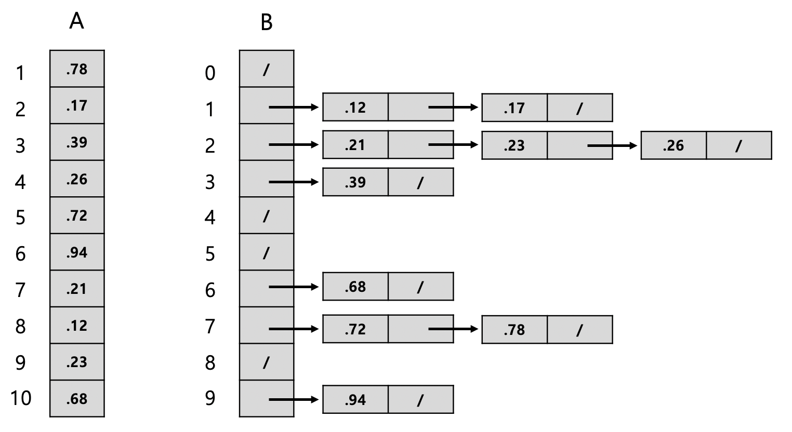

# 버킷정렬(BucketSort)


## 목차

- [버킷 정렬 개념](#개념)

- [버킷 정렬 동작 방식](#동작-방식)

- [버킷 정렬 특징](#특징)

- [버킷 정렬 시간복잡도와 공간복잡도](#시간복잡도)

- [버킷 정렬 python code](#python-code)

- [버킷 정렬 c++ code](#c-code)

- [참조](#참조)


## 개념

버킷정렬은 계수정렬과 함께 **가장 중요한 O(N) 정렬 알고리즘**이다. <br>

버킷 정렬은 특히 **값의 범위가 골고루 퍼져있을 때 (uniformly distribued)**  유용하다. <br>

예를 들어 0.0 ~ 1.0 사이의 소수점 수를 가진 큰 집합을 정렬한다고 하자. <br>

만약 숫자들을 골고루 분산되어 있다면 index 지정이 어렵기 때문에 계수정렬의 적용은 어렵고, 이럴 때  버킷 정렬이 유용하다. 


## 동작 방식

버킷 정렬의 동작 방식은 다음과 같다.

1. 데이터 n개가 주어졌을 때, 데이터의 범위를 n개로 나누고 이에 해당하는 n 개의 버킷을 만든다. <br>

2. 각각의 데이터를 해당하는 버킷에 집어 넣는다. 같은 버킷안의 들어가는 원소들은 다시 list로 보관한다. <br>
3. 버킷 별로 list안에 들어있는 원소들의 정렬을 진행한다.<br>
4. 버킷 간에는 정렬이 되어 있으므로 이를 전체적으로 합치면 전체가 정렬된다.<br>

 아래의 그림을 보고 이해해보자.




## 특징

- **안정(stable) 정렬** 알고리즘이다. <br>

- **비제자리(Not-in-place) 정렬** 알고리즘이다.  <br>

- 배열의 원소들이 특정 범위에서 넓게 분포되어있을 경우에만 유리하다.


## 시간복잡도

버킷 정렬의 시간복잡도는 위의 그림에서 A의 분포가 균등하다면 각 버킷에는 1~2개의 요소만이 속해 있을 것이다. <br>

그렇다면 1~2개의 값들만 있는 버킷을 정렬하는 데에 필요한 계산복잡도는 O(1)이라고 볼 수 있고 이러한 작업을 n개의 버킷에 <br>

모두 수행한다고 하면 전체적인 시간복잡도는 O(N)이라고 할 수 있다.


## python code

```python
def insertionSort(bucket):
    for i in range(1,len(bucket)):
        min = bucket[i]
        j = i - 1
        while j >= 0 and bucket[j] > min :
            bucket[j+1] = bucket[j]
            j -= 1
        bucket[j+1] = min
    return bucket

def bucketSort(arr):
  	#10 means 10 slots, slot's size if 0.1
    bucket = [[] for _ in range(10)]
	
  	#put elements in each buckets
    for i in arr :
        index = int(i * 10)
        bucket[index].append(i)
        
		#sort individual buckets
    for i in range(10):
        bucket[i] = insertionSort(bucket[i])
    
    #concatenate the bucket
    x = 0
    for i in range(10):
        for j in range(len(bucket[i])):
            arr[x] = bucket[i][j]
            x += 1
    
    
arr = [0.897, 0.565, 0.656, 0.1234, 0.665, 0.3434, 0.12, 0.24] 
print("정렬 전 : ", arr, end=" ") 
bucketSort(arr)
print ("-> 정렬 후 : ",arr) 
```

## c++ code

```c++
#include<iostream>
#include<vector>
#include<algorithm>
#include<random>
#define LEN 8

using namespace std;

void bucketSort(float arr[], int len){
    vector<float> bucket[len];

    for(int i = 0; i < len; i++){
        int index = len * arr[i];
        bucket[index].push_back(arr[i]);
    }

    for (int i = 0; i < len; i++){
        sort(bucket[i].begin(), bucket[i].end());
    }
    
    int index = 0;
    for (int i = 0; i < len; i++){
        for (int j = 0; j < bucket[i].size(); j++){
            arr[index++] = bucket[i][j];
        }
    }
}

int main(void){
    srand(time(NULL));
    float arr[LEN] = {0.0,};
    for (int i = 0; i < LEN; i++){
        arr[i] = rand() / (float)RAND_MAX * 1.0f ;
    }
    bucketSort(arr, LEN);
    for(int i = 0; i < LEN; i++){
        printf("%f ", arr[i]);
    }
    return 0;
}
```

## 참조


아래의 링크를 참조하여 작성하였습니다. <br>

[ratsgo's blog](https://ratsgo.github.io/data%20structure&algorithm/2017/10/18/bucketsort/)<br>

[greatzzo](https://greatzzo.tistory.com/17) <br>

[GeeksforGeeks](https://www.geeksforgeeks.org/bucket-sort-2/)<br>

