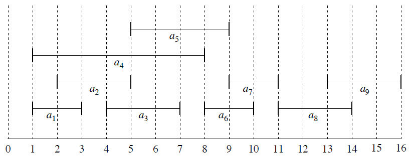
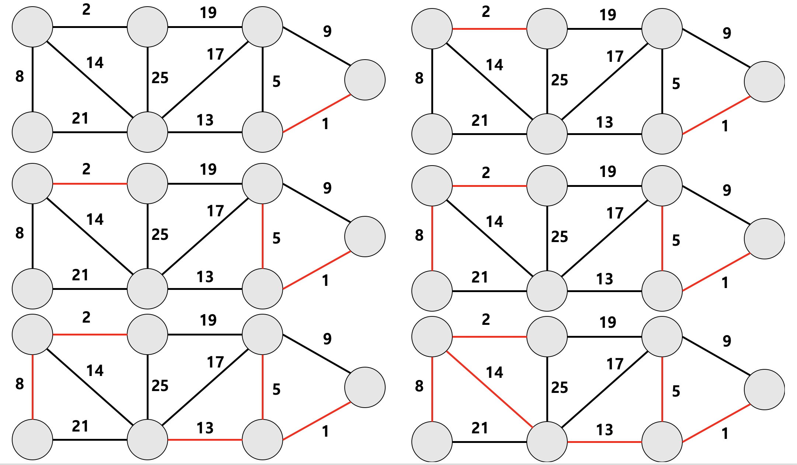
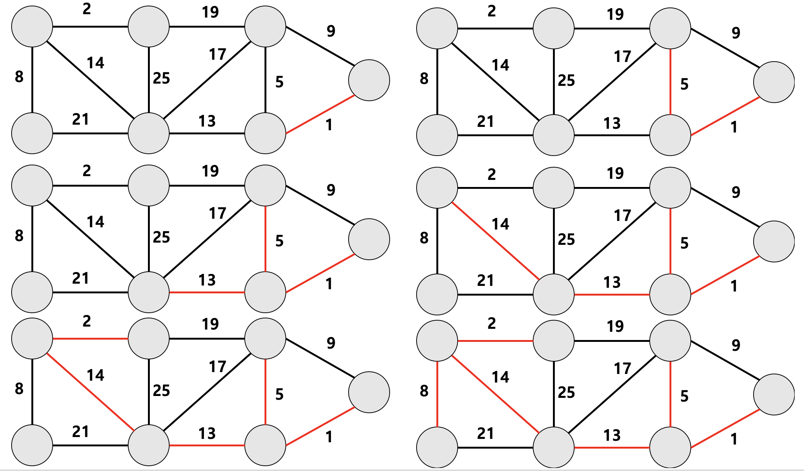

# 알고리즘 기법 Greedy Algorithm 

### 탐욕 알고리즘 (Greedy)

탐욕 알고리즘이란 **매 순간 최적이라고 생각되는 것을 선택**해 나가는 방식으로 진행하여 최종적인 최적해에 도달하는 기법을  

말한다. 동적 계획법(DP)와 마찬가지로 **최적화 문제를 푸는데 사용**하며 해를 구할 당시에 가장 최적인 해를 구하기 때문에  

동적 계획법과는 다르게 **반드시 최적의 해를 구해준다는 보장은 하지 못한다.**  

  

위의 사진에서 보다시피 Greedy algorithm의 결과 선택된 가장 큰 값과, 실제 가장 큰 값은 다른 것을 확인할 수 있다.  

탐욕 알고리즘이 잘 작동하는 문제는 **greedy choice property **와 **optimal substructure** 속성을 만족한다.  

전자는 앞의 선택이 이후 선택에 영향을 주지 않는다는 것을 의미하며, 후자는 문제 전체에 대한 최적해가 부분문제에  

대해서도 역시 최적화가 된다는 걸 뜻한다.  

예를 들면 **분할가능 배낭문제(Fractional knapsack problem)**이 가장 대표적인 탐욕 알고리즘이다.  

배낭문제는 한 여행가가 가지고 가는 배낭에 담을 수 있는 무게의 최대값이 정해져 있고, 일정 가치와 무게가 있는 짐들을  

배낭에 넣을 때 합이 최대가 되도록 짐을 고르는 방법을 찾는 문제이다.  

문제의 해결방법은 단위 무게당 가치가 가장 큰 짐을 먼저 넣으면 된다. 탐욕 알고리즘의 2가지 성질에 위배되지 않기 때문에  

분할가능 배낭문제는 그리디 알고리즘을 통해서 풀 수 있다.  

위에서도 언급하였듯이 그리디 알고리즘은 항상 최적의 해를 구해주지 못하기 때문에 **보통 "근사치 추정"을 위해서 사용**한다.  

따라서 최적이 아닌 "되는가" 또는 "적당히 괜찮은 방법"을 찾을 때에 사용가능하며, 계산속도가 최적해를 구해주는 알고리즘보다 

빠른 경우가 많기 때문에 실용적으로 사용이 가능하다.  

## 탐욕(Greedy) 알고리즘이 사용되는 예시 

1. AI에 있어서 결정 트리 학습법(Decision Tree Learning)
2. 활동 선택 문제 (Activity selection Problem)
3. 거스름돈 문제
4. 최소 신장 트리 (Minimum spanning tree) - **크루스컬(Kruskal)** 알고리즘, **프림(Prim)** 알고리즘 
5. 다익스트라 알고리즘
6. 허프만 코딩

### 활동 선택 문제 (Activity-Selection Problem)

교실 할당(classroom assignment)로도 불린다. 한정된 교실 공간에 최대 수업을 배정하는 문제이다.  

예를 들어 9개의 수업이 있고, 시작시간 s와 종료시간 f가 다음과 같이 주어졌다고 한다. (종료시간 기준 오름차순 정렬) 

|       i       |  1   |  2   |  3   |  4   |  5   |  6   |  7   |  8   |  9   |
| :-----------: | :--: | :--: | :--: | :--: | :--: | :--: | :--: | :--: | :--: |
| si |  1   |  2   |  4   |  1   |  5   |  8   |  9   |  11  |  13  |
| fi |  3   |  5   |  7   |  8   |  9   |  10  |  11  |  14  |  16  |

종료 가장 빠른 수업을 배치하게 되면 교실의 가용시간은 항상 최대가 된다. 종료시간이 빠른 수업부터 차례로 배정하기 때문에 앞의 선택이 

이후의 선택에 변화를 주지 않고, 매 순간 선택이 항상 최적이 된다. 이를 그림으로 나타내면 다음과 같아진다. 

  

따라서 한 교실에 배정할 수 있는 최대 수업의 조합은 a1, a3, a6 ,a8 인것을 확인할 수 있다.  

### 거스름돈 문제 

물건을 사고 나서 돈을 거슬러 줄 때에는 최소한의 동전 개수로 돈을 거슬러 주는 것이 좋다. 예를 들어 550원을 50원자리 11개로 거슬러 준다면  

돈을 받는 손님은 기분이 불쾌할 것이다. 따라서 이 문제는 거슬러 줄 총액에 해당하는 동전의 집합이며, 최적해는 동전의 개수의 최소 집합이다.  

따라서 문제를 해결하기 위해서는 가장 가치가 큰 동전을 우선으로 거스름돈을 구성하면 동전의 개수가 줄어들테니, 가장 가치가 높은 동전부터  

부분해 집합에 추가한다. 다음에는 부분해 집합이 거슬러 줄 금액을 초과한다면, 최근 추가한 동전을 제거하고 가치가 한 단계 낮은 동전을 추가한다.  

이를 통해 거스름돈 문제는 해결 된것 같지만 예를 들어 물건의 금액이 3800원이고 손님이 낸 금액이 5000원이라면 위의 알고리즘은 

500원,100원, 50원, 10원이 있는 경우 500x2 100x2를 거슬러주게 된다. 하지만 만약 400원 짜리 동전이 있다면 400x3이므로 최적의 방법을   

찾지 못하게 된다. 따라서 **그리디는 항상 최적의 결과를 보장하지는 못한다.** 

### 최소비용 신장트리 (Minimum Spanning Tree)

최소비용 신장트리는 그래프 내의 모든 정점을 최소의 비용으로 연결하는 트리를 의미한다.   

최소비용 신장트리를 만드는 알고리즘에는 프림 알고리즘과 크루스칼 알고리즘 크게 두 가지가 있다.  

##### 크루스칼 알고리즘(Kruskal Algorithm)  

크루스칼 알고리즘은 위의 그림과 같이 그래프의 모든 간선(edge) 중에서 **가중치가 가장 작은 것부터 차례대로 선택**한다.  

이때 Cycle을 만드는 경우를 제외하고 간선들을 선택하다 보면 최소비용 신장트리를 만들 수 있다.  

##### 프림 알고리즘(Prim Algorithm)  

**임의의 정점(vertex)에서 가중치가 가장 작은 간선(edge)을 선택**한다. 선택된 정점(vertex)와 연결된 간선(edge)들 중에서 가장 가중치가  

작은 것들을 선택하여 최소비용 신장트리를 만든다. (단, 이때도 Cycle을 만드는 경우는 제외한다.)  

### 다익스트라 알고리즘 (Dijkstra's Algorithm)

다익스트라 알고리즘은 그래프 내의 한 정점에서 다른 정점으로 가는 최단 경로를 구하는 알고리즘이다.   

### 허프만 코딩 (Huffman Coding)

허프만 코딩이란 탐욕 알고리즘을 사용해서 데이터를 압축하는 기법이다. 

### 장점

1. 구현이 비교적 쉽다.
2. 계속 속도가 정확한 알고리즘보다 빠른 경우가 많다. 

### 단점

1. 항상 최적해를 구하지 못한다. 

## 참조 

아래의 블로그를 참고하여 작성하였습니다.  

[그리디 알고리즘 - 나무위키](https://namu.wiki/w/%EA%B7%B8%EB%A6%AC%EB%94%94%20%EC%95%8C%EA%B3%A0%EB%A6%AC%EC%A6%98)  

[탐욕 알고리즘 위키피디아](https://ko.wikipedia.org/wiki/%ED%83%90%EC%9A%95_%EC%95%8C%EA%B3%A0%EB%A6%AC%EC%A6%98)  

[i.m_ujin 그리디 알고리즘](https://ujink.tistory.com/10) 

[좡 그리디 알고리즘](https://janghw.tistory.com/entry/%EC%95%8C%EA%B3%A0%EB%A6%AC%EC%A6%98-Greedy-Algorithm-%ED%83%90%EC%9A%95-%EC%95%8C%EA%B3%A0%EB%A6%AC%EC%A6%98)  

[ratsgo's blog](https://ratsgo.github.io/data%20structure&algorithm/2017/11/22/greedy/) 