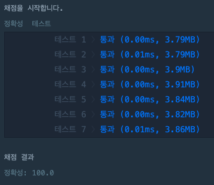
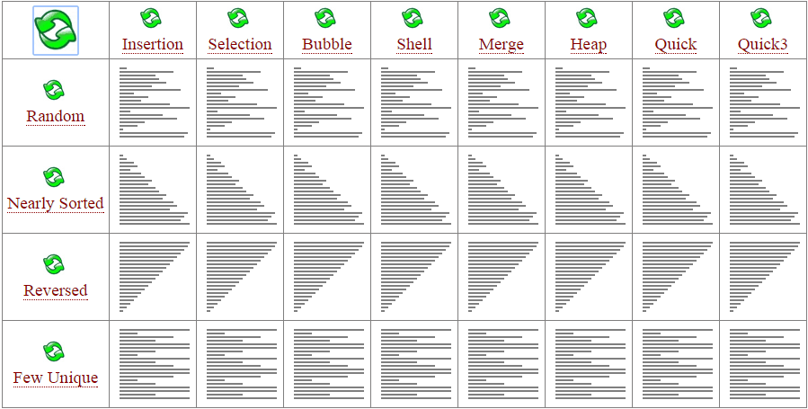

## 삽입 정렬 (Insertion Sort)
### 개념 : 삽입 정렬은 각 숫자를 적절한 위치에 삽입 하는 정렬 <br>
삽입 정렬은 두 번째 자료부터 시작하여 그 앞(왼쪽)의 자료들과 비교하여 삽입할 위치를 지정한 후 자료를 뒤로 옮기고 지정한 자리에 자료를 삽입하여 정렬한다. <br>
즉, 두 번째 자료는 첫 번째 자료, 세 번째 자료는 두 번째와 첫 번째 자료, 네 번째 자료는 세 번째, 두 번째, 첫 번째 자료와 비교한 후 자료가 삽입될 위치를 찾는다.<br>
자료가 삽입될 위치를 찾았다면 그 위치에 자료를 삽입하기 위해 자료를 한 칸씩 뒤로 이동시킨다.<br>
처음 Key 값은 두 번째 자료부터 시작한다.

## 프로그래머스 정렬 문제 - K 번째 수 
  - https://programmers.co.kr/learn/courses/30/lessons/42748

## 접근 방법
1. commands의 size만큼 반복하여 commands[i][0]부터 commands[i][1]까지 주어진 배열 자르기 <br>
2. 구현한 삽입 정렬 함수를 사용하여 정렬 (c++, python 기본 제공 sort라이브러리 사용 x) <br>
3. 정렬된 배열에서 commands[i][2]의 값을 index로 가지는 원소를 꺼내서 answer에 추가 

## python code
```python
#프로그래머스 k 번쨰 수
#삽입 정렬 함수
def insertionSort(object):
    arr_len = len(object)
    for i in range(1,arr_len): # 0번째 원소는 제외하고, 1번째 원소부터
        key,min = object[i],i
        while min > 0 and object[min-1]>key: #앞에 있는 원소들이랑 비교해서 key보다 크면
            object[min] = object[min-1] # 해당 값을 오른쪽으로 이동
            min -= 1
        object[min] = key 
            
def solution(array, commands):
    answer = []
    for i in commands :
        temp = array[i[0]-1:i[1]]
        insertionSort(temp)
        answer.append(temp.pop(i[2]-1))
    return answer
``` 
### 수행 속도


## c++ code
```c++
#include <string>
#include <vector>
#include <iostream>
#include <algorithm>

using namespace std;
void insertionSort(vector<int> &arr){
    int j , key = 0, len = arr.size();
    for(int i = 1; i < len; i++){
        key = arr[i];
        for(j = i-1; j >= 0; j--){
            if(key < arr[j]){
                arr[j+1] = arr[j];
            }
            else break;
        }
        arr[j+1] = key;
    }
} 

vector<int> solution(vector<int> array, vector<vector<int>> commands) {
    vector<int> answer;
    vector<int> temp;
    for(int i =0; i< commands.size();i++){
        temp={};
        for(int j = commands[i][0] - 1; j<commands[i][1];j++){
            temp.push_back(array[j]);
        }
        insertionSort(temp); //sort(temp.begin(),temp.end());
        answer.push_back(temp[commands[i][2]-1]);
    }
    return answer;
}
```
### 수행속도


## 시간복잡도
최선의 경우 : 

## 공간복잡도


